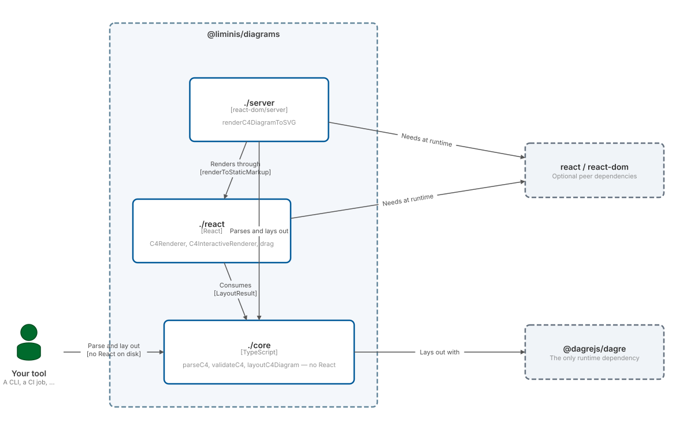

`@liminis/diagrams` has four subpath exports. Which one(s) you install determines
whether React ends up in your dependency tree at all.

| Import | Needs React installed? | What it gives you |
|---|---|---|
| `@liminis/diagrams` | no | re-export of `./core` |
| `@liminis/diagrams/core` | no | `parseC4`, `validateC4`, `layoutC4Diagram`, and all types |
| `@liminis/diagrams/react` | yes | `C4Renderer`, `C4InteractiveRenderer`, `useC4DiagramDrag` |
| `@liminis/diagrams/server` | yes | `renderC4DiagramToSVG` — source to SVG in one call |

## Does installing this package require React?

No. `react` and `react-dom` are **optional peer dependencies**. `npm install
@liminis/diagrams` (or the pnpm/yarn equivalent) pulls in `@dagrejs/dagre` and nothing
else. `./core` has `@dagrejs/dagre` as its only runtime dependency — no React, no DOM
globals, no `document`/`window` anywhere on that path. That's what makes it usable from
a CLI, a CI job, or a worker thread with nothing else on disk.

If you only need to parse C4-PlantUML source and lay it out — not render it to
anything — install the base package and import from `./core`. You are done; there is
no React to add.

The cost of optional peers: importing `./react` or `./server` without `react`/`react-dom`
installed fails at **runtime**, not at install time. If you're building a headless tool
and want to be certain nothing accidentally imports `./react`, don't add the peers.

## Why isn't `./server` part of `./core`?

`./server` (`renderC4DiagramToSVG`) is DOM-free — it never touches `document` or
`window`, so it runs fine in Node, an Electron main process, or CI. But it is **not
React-free**: it drives the presentational `C4Renderer` component through React's
`renderToStaticMarkup` (via `react-dom/server`) to produce the SVG string. "DOM-free"
and "React-free" are different properties, and `./server` only has the first one.

Because it needs `react`/`react-dom` at runtime, bundling it into `./core` would make
`./core`'s "dagre and nothing else" guarantee false. Keeping it in a separate entry
point means a consumer who only wants `./core` never pays for React, even transitively.

*(There's a deferred idea — not built — of a React-free SVG serializer that walks
`LayoutResult` directly and would let `./core` own the whole parse→SVG path with dagre
as its only dependency. It doesn't exist today.)*

## The three-layer stack

Rendered by this package, from C4-PlantUML source — the same path any consumer takes.
Drag a box if the automatic layout puts something awkwardly, or expand it for room.

```c4 readOnly height=26rem
Person(host, "Your tool", "A CLI, a CI job, a wiki, an editor")

System_Boundary(pkg, "@liminis/diagrams") {
  Container(core, "./core", "TypeScript", "parseC4, validateC4, layoutC4Diagram — no React")
  Container(rct, "./react", "React", "C4Renderer, C4InteractiveRenderer, drag")
  Container(srv, "./server", "react-dom/server", "renderC4DiagramToSVG")
}

System_Ext(dagre, "@dagrejs/dagre", "The only runtime dependency")
System_Ext(peers, "react / react-dom", "Optional peer dependencies")

Rel(host, core, "Parse and lay out", "no React on disk")
Rel(core, dagre, "Lays out with")
Rel(rct, core, "Consumes", "LayoutResult")
Rel(srv, core, "Parses and lays out")
Rel(srv, rct, "Renders through", "renderToStaticMarkup")
Rel(rct, peers, "Needs at runtime")
Rel(srv, peers, "Needs at runtime")
```
<picture><source media="(prefers-color-scheme: dark)" srcset="./diagrams/architecture-1-dark.svg" /></picture>

`./react` is presentational plus interaction (drag), and knows nothing about Lexical,
editors, or persistence — see the [Limitations](../#limitations--read-this-first)
section for what that implies. `./server` is a thin wrapper that chains `./core`'s parse
and layout with `./react`'s presentational renderer through `react-dom/server`, so a
headless caller gets one function instead of three.

## Picking an entry point

- **Headless CLI/CI tool that only needs the parsed diagram or a layout result** (no
  image output) → `./core`. No React anywhere.
- **Headless CLI/CI tool that needs an SVG file** → `./server`. Needs `react` +
  `react-dom` installed, but nothing DOM-related.
- **Interactive UI, embedding the renderer in your own app, with or without drag** →
  `./react`. Needs `react` + `react-dom`, and a DOM (browser or jsdom/happy-dom).

See [Recipes](../recipes/) for complete, runnable examples of the first two.
