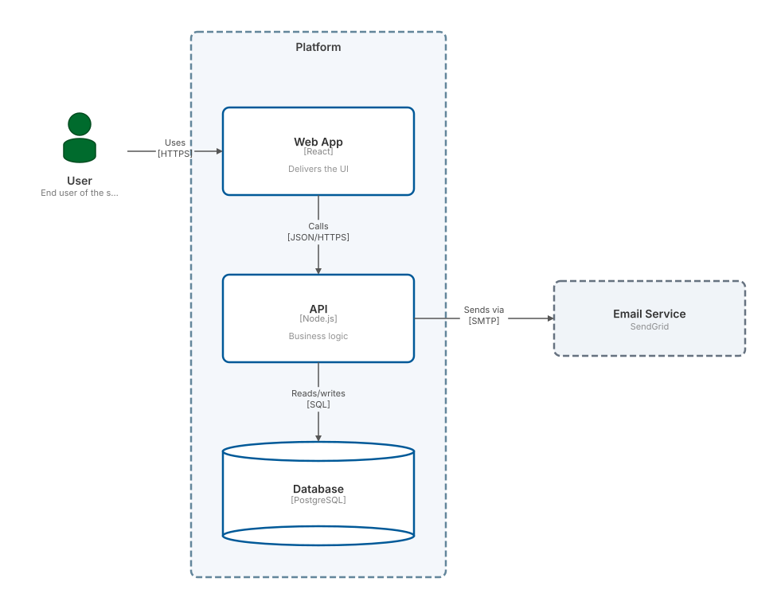

Everything below runs the **published** `@liminis/diagrams` — it is a real registry
dependency of this documentation site, exactly as it would be in your project. What you
drag here is what `npm install` gives you.

## Parse, lay out, render

Edit the source and the diagram follows. Parsing happens on every keystroke; there is no
build step and no server involved.

```c4
Person(user, "User", "End user of the system")

System_Boundary(platform, "Platform") {
  Container(web, "Web App", "React", "Delivers the UI")
  Container(api, "API", "Node.js", "Business logic")
  ContainerDb(db, "Database", "PostgreSQL", "Stores everything")
}

System_Ext(mail, "Email Service", "SendGrid")

Rel(user, web, "Uses", "HTTPS")
Rel(web, api, "Calls", "JSON/HTTPS")
Rel(api, db, "Reads/writes", "SQL")
Rel(api, mail, "Sends via", "SMTP")
```


Drag a node and the arrows re-route around it. Turn the checkbox off and the drag layer
disappears entirely — that is `isEditMode`, and it is the host's decision, not the
library's.

## Positions are yours to keep

The renderer is **controlled**. It takes positions in and calls back with new ones; it
never writes anywhere. The counter above the diagram is this page's own state — reload
and it is gone, because a docs page chose not to persist it.

A real host decides differently. `@liminis/editor` writes positions into the markdown
code fence's own meta string, which leaves a hand-arranged diagram sitting in plain,
diffable text. See [Recipes](./recipes/) for that pattern in full.

## Errors are data, not exceptions

Break the syntax — delete a closing brace, misspell `Rel` — and the parser returns
errors rather than throwing. This is `C4ErrorDisplay` rendering
`ParseResult.errors` directly.

```c4 editable=false height=14rem invalid
Person(user, "User")
System(app, "App")
Rel(user, app, "Uses"
```
